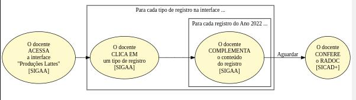

<table>
<tr>
<td>  </td>
  <td><a href="./lattes.md"><H1>Registros RADOC oriundos do <i>Lattes</i></H1></a></td>
</tr>
</table>

O conteúdo do _Currículo Lattes_ é uma das **fontes de informação do RADOC**:

> Os tipos de registro passíveis de importação a partir do _Lattes_ são ilustrados [**AQUI**](../media/interface-lattes.jpg).

A figura a seguir ilustra o **Fluxo para Registros RADOC oriundos do _Lattes_**.

Cabe ao docente COMPLEMENTAR via SIGAA os registros oriundos do _Lattes_:
1. O docente ALIMENTA o _**Lattes**_ com os dados de suas produções e atividades.
1. O docente AGUARDA para que os registros no _**Lattes**_ sejam importados para o RADOC.
1. O docente ACESSA a _interface_ para **Produções Lattes** no SIGAA:
   - Entre no SIGAA.
   - Selecione "Produção Intelectual" >> "Minhas Produções - Lattes".
   - Uma tela (_interface_) é exibida, com os tipos de registro passíveis de importação a partir do _Lattes_:
     - clique [**AQUI**](../media/lattes.jpg) para ver a _interface_ exibida.
1. O docente COMPLEMENTA o registro oriundo do _**Lattes**_:
   1. Selecione (clique em) um tipo de registro:
   1. Para **cada registro** do tipo de registro selecionado:
      - o docente COMPLEMENTA o conteúdo do registro;
      - por exemplo, se o registro importado for "artigo completo publicado em periódico", então é necessário complementar:
        - projeto associado; e
        - classificação Qualis/CAPES.
1. O docente AGUARDA o processamento dos complementos de registros.
1. O docente CONFERE os dados dos registros no RADOC via SICAD+.

Fim &#9997;
