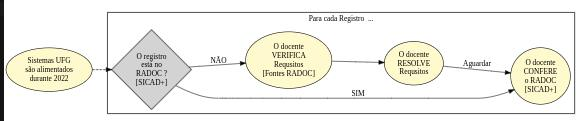

#  Registros RADOC importados de <i>SISTEMAS UFG</i>

Os Sistemas da UFG são uma das <ins>**Fontes de informação do RADOC**</ins>:
> Contudo, há requisitos para que os registros sejam importados e pontuados no RADOC.

## FLUXO para Registros RADOC importados a partir de Sistemas da UFG

Cabe ao docente AVERIGUAR **se todos** os registros oriundos de portarias estão presentes no RADOC:
1. O docente IDENTIFICA <ins>**todas as suas portarias**</ins>:
   - Portarias que mencionam o seu nome; E
   - Portarias com vigência [de pelo menos um dia] em 2022:
     - inclui portarias emitidas em anos anteriores.
1. Para <ins>**cada uma de suas portarias**</ins>:
   1. O docente CHECA [via SICAD+] se a portaria [e sua pontuação] estão no RADOC:
      - Em caso NEGATIVO:
        - o docente SOLICITA a inserção do registro da portaria no RADOC via [Formulário](https://forms.gle/ZTpzozkuU1vyBHUB8);
        - o docente AGUARDA o processamento do formulário (solicitação de inserção).
   1. O docente CONFERE os dados do registro da Portaria no RADOC via SICAD+.

Fim &#9997;
