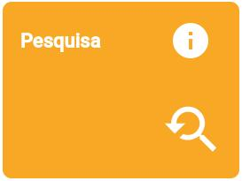
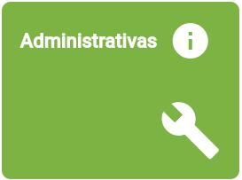
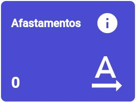

# Alimentar o RADOC

> O Painel abaixo busca a orientar o docente sobre **inserir registros** no RADOC/SICAD+:
1. Clique no quadro que melhor denota o registro a ser inserido.
1. Selecione o tipo de registro, e obtenha COMO INCLUIR o registro.

Fim &#9997;
