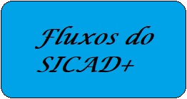
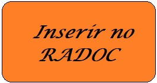

# Mural INF/UFG sobre o RADOC/SICAD+

> Os cartões abaixo orientam sobre o RADOC/SICAD+: &#9749; Sugestão: inicie por "Apresentação" e siga os cartões em sentido horário.

---
## Cronograma

|Seq|ATIVIDADE|QUEM|**DATA LIMITE**|
|-|-|-|-|
|1|Alimentar e enviar o RADOC para a Comissão|Docente|**15 Nov 2022**|
|2|Analisar e devolver os RADOCs com anotações ao Docente|Comissão|**28 Nov 2022**|
|3|Ajustar o RADOC conforme anotações e devolver a Comissão|Docente|**05 Dez 2022**|
|4|Analisar os RADOCs ajustados e elaborar **Relatórios Finais**|Comissão|**15 Dez 2022**|

Fim	&#9749;

